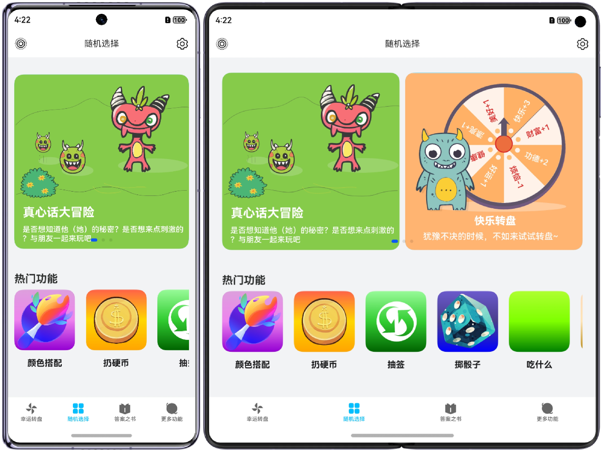
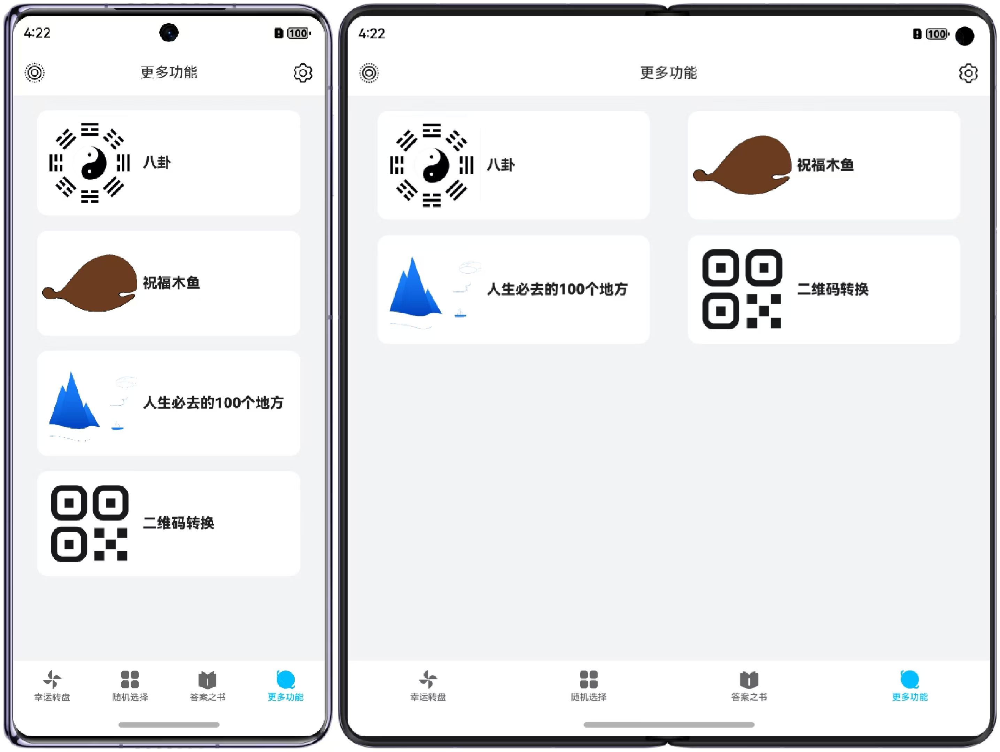
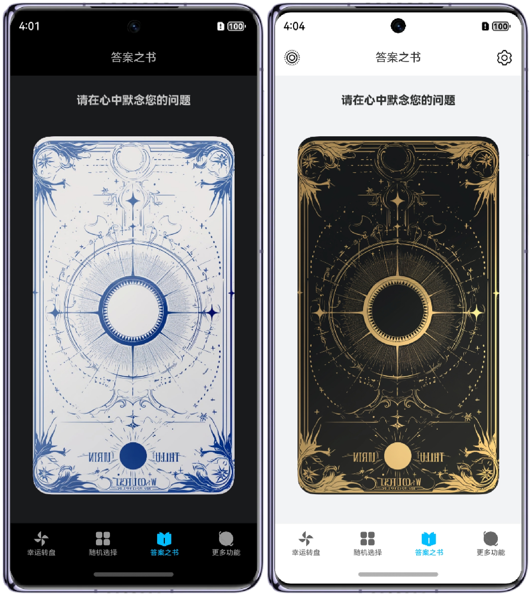
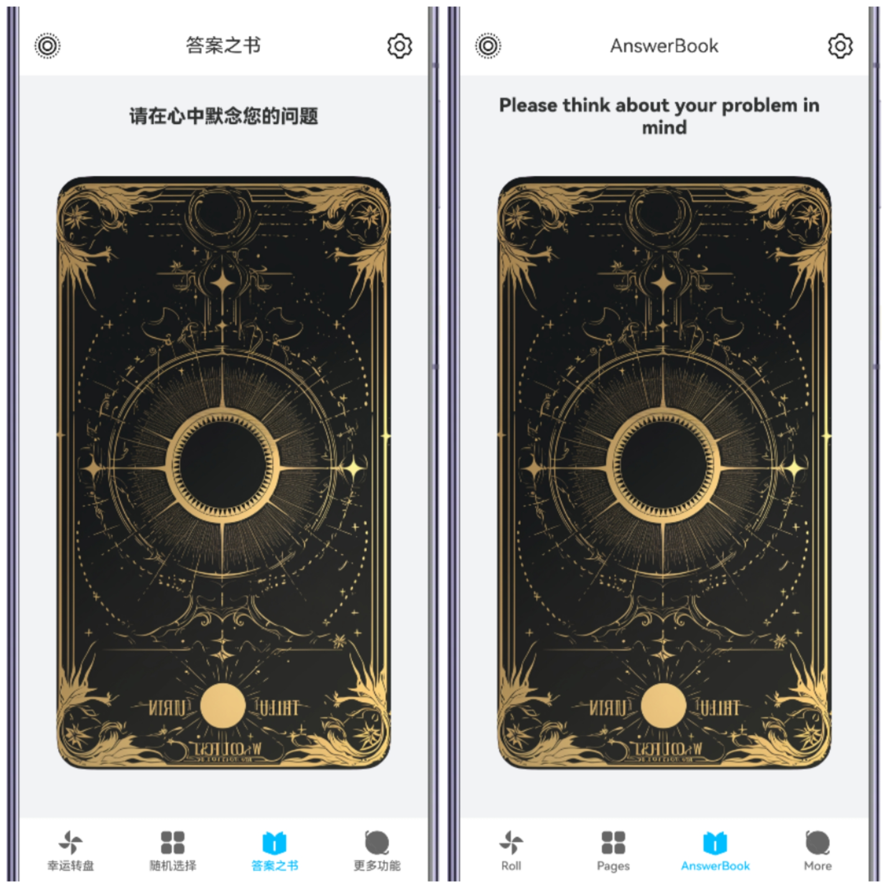

# 🎲 随易 EasyRandom

<p align="center">
  
  &nbsp;&nbsp;&nbsp;&nbsp;
  
</p>

<p align="center">
  <strong>面向生活的随机工具箱 · 纯血鸿蒙原生应用</strong>
</p>
<p align="center">
  
  
  
  
</p>


---

## 📖 项目简介

> 随易是一款基于 **HarmonyOS NEXT（纯血鸿蒙）** 原生开发的日常生活随机工具箱应用。
>
> 集成各个功能的工具箱，例如：抽签、掷骰子、丢硬币、随机数等。
>
> 同时提供一些有趣的功能，例如：幸运转盘、真心话大冒险、答案之书、祝福木鱼等。
>
> 

**目标**：打造一个覆盖手机、平板、折叠屏、车机、手表等多形态设备的全场景鸿蒙工具箱，充分利用 HarmonyOS 新特性（服务卡片、元服务、多设备协同等）。

---

## ✨ 核心特性

| 特性 | 说明 |
|------|------|
| 🧩 **多设备适配** | 支持手机、平板、2in1、车机，手表端开发中 |
| 📱 **服务卡片** | 桌面服务卡片，无需打开应用即可使用 |
| 🔗 **元服务** | 提供轻量级元服务版本，即点即用 |
| 🌐 **多语言** | 支持中文简体、English,部分支持Japanese，其他语言适配中 |
| 🌙 **暗夜模式** | 完整适配深色主题 |
| 📐 **响应式布局** | 基于断点系统的自适应栅格布局 |
| 🔒 **隐私合规** | 内置隐私政策弹窗，符合应用市场审核要求 |
| 📊 **VitalUI 图表库** | 自研图表组件库（饼图、玫瑰图、雷达图等） |

---

## 📸 特性预览

### 多设备适配

<p align="center">
  
  
</p>

### 暗夜模式 & 多语言

<p align="center">
  
  
</p>

### 服务卡片

<p align="center">
  
  
  
  
</p>

---

## 🏗️ 技术架构

### 技术栈

- **语言**：ArkTS（TypeScript 超集）
- **UI 框架**：ArkUI（声明式 UI）
- **SDK 版本**：HarmonyOS NEXT (API 13+)
- **构建工具**：hvigor
- **模块化方案**：HAP + HAR 多模块架构

### 模块架构

```
app_EasyRandom
├── product/default         # 主入口模块 (HAP)  — 手机/平板/2in1/车机
├── product/wearable        # 手表模块 (HAP)   — 开发中，暂未启用
├── common/basic            # 公共基础库 (HAR)  — 通用组件、工具函数
└── common/VitalUI          # 图表组件库 (HAR)  — 饼图、玫瑰图、雷达图
```

### 依赖关系

```
product/default  ──→  @ohos/common (basic)
                  ──→  @ohos/vitalui (VitalUI)
product/wearable  ──→  @ohos/common (basic)
```

---

## 📁 项目结构

```
app_EasyRandom/
├── AppScope/                              # 应用全局配置
│   ├── app.json5                          # 应用包名、版本信息
│   └── resources/                         # 全局资源
│       ├── base/                          # 默认资源 (zh-CN)
│       │   ├── element/                   # 颜色、字符串等 token
│       │   └── media/                     # 全局媒体资源
│       ├── dark/                          # 暗夜模式颜色覆盖
│       ├── en/                            # 英文资源
│       ├── ja/                            # 日文资源
│       └── ldpi/ mdpi/ sdpi/ xldpi/ xxldpi/ xxxldpi/  # 分辨率适配资源
│
├── build-profile.json5                    # 顶层构建配置（签名、产品、模块注册）
│
├── common/                                # 共享库目录
│   ├── basic/                             # 公共基础库 (HAR) — @ohos/common
│   │   └── src/main/ets/
│   │       ├── components/                # 公共 UI 组件
│   │       │   ├── MainPage.ets           # 通用主页面框架
│   │       │   └── ColorPickerComponent/  # 颜色选择器组件
│   │       └── utils/                     # 工具函数
│   │           ├── BreakPointSystem.ets   # 断点系统（响应式布局）
│   │           ├── CommonConstants.ets    # 全局常量
│   │           ├── GlobalContext.ets      # 全局上下文管理
│   │           ├── Logger.ets             # 日志工具
│   │           └── Math.ets              # 数学工具函数
│   └── VitalUI/                           # 自研图表组件库 (HAR) — @ohos/vitalui
│       └── src/main/ets/
│           ├── chart/                     # 图表组件（饼图、玫瑰图、雷达图）
│           ├── Demo/                      # 组件演示页面
│           └── utils/                     # 图表工具函数
│
├── product/                               # 产品模块目录
│   ├── default/                           # 主入口模块 (HAP) — 手机/平板/2in1/车机
│   │   └── src/main/
│   │       ├── ets/
│   │       │   ├── entryability/          # 主 Ability（应用生命周期）
│   │       │   ├── entrybackupability/    # 备份恢复 Ability
│   │       │   ├── defaultformability/    # 服务卡片 Ability
│   │       │   ├── pages/                 # 主页面（Tab 根页面）
│   │       │   │   ├── IndexPage/         # 应用壳页（导航入口）
│   │       │   │   ├── RollPage/          # 幸运转盘主页
│   │       │   │   ├── SettingPage/       # 设置页面
│   │       │   │   ├── AnswerPage.ets     # 答案之书
│   │       │   │   ├── CardsPage.ets      # 服务卡片展示页
│   │       │   │   ├── MorePage.ets       # 更多功能页
│   │       │   │   ├── RandomPage.ets     # 随机工具主页
│   │       │   │   └── ToolsPage.ets      # 工具箱入口页
│   │       │   ├── sub_pages/             # 子功能页面
│   │       │   │   ├── a_standard/        # 规范示例/测试标准页
│   │       │   │   ├── answer_book/       # 答案之书
│   │       │   │   ├── blessing_muyu/     # 祝福木鱼
│   │       │   │   ├── devine_bagua/      # 八卦占卜
│   │       │   │   ├── flip_coin/         # 丢硬币
│   │       │   │   ├── flip_dices/        # 掷骰子
│   │       │   │   ├── honest_or_challenge/ # 真心话大冒险
│   │       │   │   ├── random_abcd/       # ABCD 选择器
│   │       │   │   ├── random_colors/     # 颜色搭配
│   │       │   │   ├── random_foods/      # 吃什么
│   │       │   │   ├── random_names/      # 抽签
│   │       │   │   ├── random_numbers/    # 随机数
│   │       │   │   ├── random_places/     # 随机景点
│   │       │   │   ├── roll_wheel/        # 幸运转盘（子页）
│   │       │   │   ├── text_marquee/      # 手持弹幕
│   │       │   │   └── trans_qr/          # 二维码转换
│   │       │   ├── form_cards/            # 服务卡片 UI 组件
│   │       │   │   ├── ABCDCard.ets
│   │       │   │   ├── BaGuaCard.ets
│   │       │   │   ├── BlessingMuyuCard.ets
│   │       │   │   ├── FlipCoinCard.ets
│   │       │   │   ├── RandomColorsCard.ets
│   │       │   │   ├── RollDiceCard.ets
│   │       │   │   └── RollWheelCard.ets
│   │       │   ├── form_display/          # 卡片在应用内预览展示
│   │       │   ├── design_privew/         # UI 设计预览/测试页
│   │       │   ├── static_datas/          # 静态数据文件
│   │       │   │   ├── answers.ets        # 答案之书数据
│   │       │   │   ├── challenges.ets     # 真心话大冒险题目
│   │       │   │   ├── foods.ets          # 吃什么食物数据
│   │       │   │   ├── names.ets          # 抽签名单数据
│   │       │   │   └── places.ets         # 随机景点数据
│   │       │   └── utils/
│   │       │       └── ApiVersionUtil.ets # API 版本兼容工具
│   │       └── resources/                 # 模块资源
│   │           └── base/profile/
│   │               ├── main_pages.json    # 页面路由注册
│   │               ├── route_map.json     # 路由映射
│   │               └── form.json          # 服务卡片配置
│   │
│   └── wearable/                          # 手表模块 (HAP) — 开发中
│       └── src/main/ets/
│           ├── wearableability/           # 手表 Ability
│           ├── wearablebackupability/     # 手表备份 Ability
│           ├── Contexts/                  # 上下文管理
│           └── pages/                     # 手表页面
│
├── docs/                                  # 项目文档
│   ├── PROJECT.md                         # 开发手册（命名规范、组件、路由等）
│   ├── tutorial_build_version.md          # 构建版本号教程
│   ├── wearable-plan.md                   # 手表端实现方案
│   ├── api-update/                         # API 升级追踪文档
│   │   ├── 12to13.md                       # API 12→13 变更分析
│   │   └── 12to18.md                       # API 12→18 变更分析
│   └── feature-design/                    # 功能设计文档
│       ├── VibratorManager.md              # 振动接入方案
│       └── ...                             # 其他功能设计文档
│
├── preview/                               # 应用预览截图
├── build/                                 # 构建产物 (.hap / .app)
└── hvigor/                                # hvigor 构建脚本配置
```

---

## 🎯 功能模块

### 🏠 首页 Tab

| Tab | 名称 | 说明 |
|-----|------|------|
| 1 | 幸运转盘 | 自定义转盘抽奖，支持编辑轮盘项 |
| 2 | 功能卡片 | 预览服务卡片效果，支持一键添加到桌面 |
| 3 | 答案之书 | 默念问题，翻开属于你的答案 |
| 4 | 工具箱 | 全部功能入口列表 |

### 🧰 工具箱功能

| 功能 | 状态 | 页面路径 | 说明 |
|------|:----:|----------|------|
| 🎡 幸运转盘 | ✅ | RollPage/RollWheelPage | 自定义轮盘抽奖，可视化编辑 |
| 📖 答案之书 | ✅ | AnswerPage | 经典翻书式随机答案 |
| 🎲 掷骰子 | ✅ | flip_dices/RollDices | 多骰子组合投掷 |
| 🪙 丢硬币 | ✅ | flip_coin/FlipCoin | 硬币翻转动画 |
| 🔢 随机数 | ✅ | random_numbers/RandomNumbers | 自定义范围随机数生成 |
| 🍜 吃什么 | ✅ | random_foods/RandomFoods | 随机推荐美食 |
| 🎨 颜色搭配 | ✅ | random_colors/RandomColors | 随机色彩搭配灵感 |
| ✍️ 抽签 | ✅ | random_names/RandomNames | 自定义名单抽取 |
| 🎯 真心话大冒险 | ✅ | honest_or_challenge/HonestOrChallenge | 双模式挑战 |
| ☯️ 八卦占卜 | ✅ | devine_bagua/DevineBaGua | 传统八卦占卜 |
| 🐟 祝福木鱼 | ✅ | blessing_muyu/BlessingMuyu_V2 | 敲击木鱼积累功德 |
| 🌍 人生必去的100个地方 | ✅ | random_places/RandomPlaces | 旅行灵感随机推荐 |
| 🔤 ABCD 选择器 | ✅ | random_abcd/RandomABCD | 快速四选一决策 |
| 📱 手持弹幕 | ✅ | text_marquee/TextMarquee | LED 滚动字幕 |
| 🔄 二维码转换 | ✅ | trans_qr/TransQR | 文字/链接转二维码 |
| 🃏 抽卡 | 🚧 | — | 模拟抽卡体验 |
| 🥢 圣杯 | 🚧 | — | 传统掷筊占卜 |
| ☯️ 64卦 | 🚧 | — | 完整易经六十四卦 |
| 📐 单位转换 | 🚧 | — | 多类型单位换算 |
| 🧮 计算器 | 🚧 | — | 基础 / 科学计算器 |
| 🔮 塔罗牌 | 🚧 | — | 塔罗牌占卜 |
| 💱 进制转换 | 🚧 | — | 二/八/十/十六进制互转 |
| 🐾 电子宠物 | 🚧 | — | 桌面电子宠物 |

### 🧩 服务卡片（桌面小组件）

| 卡片 | 状态 | 尺寸 | 说明 |
|------|:----:|:----:|------|
| 🎲 骰子卡片 | ✅ | 2×2 | 点击投掷骰子 |
| 🪙 硬币卡片 | ✅ | 2×2 | 点击抛硬币 |
| 🎡 转盘卡片 | ✅ | 2×2 / 4×4 | 迷你幸运转盘 |
| ☯️ 八卦卡片 | ✅ | 2×2 / 4×4 | 八卦占卜结果 |
| 🎨 颜色卡片 | ✅ | 2×2 | 随机颜色展示 |
| 🔤 ABCD 卡片 | ✅ | 2×2 | 四选一抽选 |
| 🐟 木鱼卡片 | ✅ | 2×2 | 敲木鱼快捷入口 |
| 🐾 电子宠物卡片 | 🚧 | 2×2 / 4×4 | 桌面养成互动 |

---

## 🗺️ 未来计划

- [x] 主页面 UI 重构
- [x] 液态玻璃效果适配
- [x] 震动反馈
- [ ] 手表端 (wearable) 完整适配
- [ ] 折叠屏深度适配
- [ ] PC 端 (2in1) 大屏适配

---

## 🚀 快速开始

### 环境要求

- **DevEco Studio**：5.0.0 及以上版本
- **HarmonyOS SDK**：API 13+ (HarmonyOS NEXT)
- **设备系统**：HarmonyOS NEXT 5.0.0+

### 项目配置

- **应用包名**：`ydy.App.EasyRandom`
- **元服务包名**：`com.atomicservice.5765880207854873613`

### 构建运行

```bash
# 1. 克隆项目
git clone https://gitee.com/Yan_m233/app_EasyRandom

# 2. 使用 DevEco Studio 打开项目

# 3. 配置签名

# 4. 点击运行或使用命令行构建
hvigorw assembleHap
```

---

## 📦 开源依赖备忘录

本项目参考到以下开源内容，特此致谢。

| 项目                                                                                            |   版本   | 协议         | 用途           |
|-----------------------------------------------------------------------------------------------|:------:|------------|--------------|
| [@ohos/hypium](https://developer.huawei.com/consumer/cn/doc/harmonyos-guides/hypium-overview) | 1.0.18 | Apache 2.0 | 鸿蒙官方单元测试框架   |
| [@ohos/hamock](https://developer.huawei.com/consumer/cn/doc/harmonyos-guides/hamock-overview) | 1.0.0  | Apache 2.0 | 鸿蒙官方 Mock 框架 |
| BrakePoint 断点系统                                                                               |  ---   | ---        | 华为开发者官网示例代码  |
| Logger 日志系统                                                                                   |  ---   | ---        | 华为开发者官网示例代码  |


---

## 👥 开发团队

### 软件开发

| 角色 | 成员 |
|------|------|
| 主程 / 架构 | 闫东阳 |

### 美术设计

| 角色 | 成员 |
|------|------|
| UI / UX 设计 | 岑纯阳、宋婷婷、王浩铭、王璞 |

### 测试

| 角色 | 成员 |
|------|------|
| 质量保证 | Sallauknoe、金浩翔、阿拉灯神丁 |

---

## 📬 联系我们

| 渠道 | 地址 |
|------|------|
| 📧 邮箱 | [3014551329@qq.com](mailto:3014551329@qq.com) |
| 📺 B站 | [随易 EasyRandom 创作页](https://www.bilibili.com/opus/971320804050468900?spm_id_from=333.1387.0.0) |

---

## 📄 开源协议

本项目基于 [Apache License 2.0](https://www.apache.org/licenses/LICENSE-2.0) 开源。

---

## 🔗 相关链接

- **随易元服务**：应用内可跳转元服务版本（`com.atomicservice.5765880207854873613`）
- **隐私政策**：应用内设置页可查看

---

<p align="center">
  <sub>Built with ❤️ using HarmonyOS ArkTS | © 2024-2026 闫东阳</sub>
</p>
